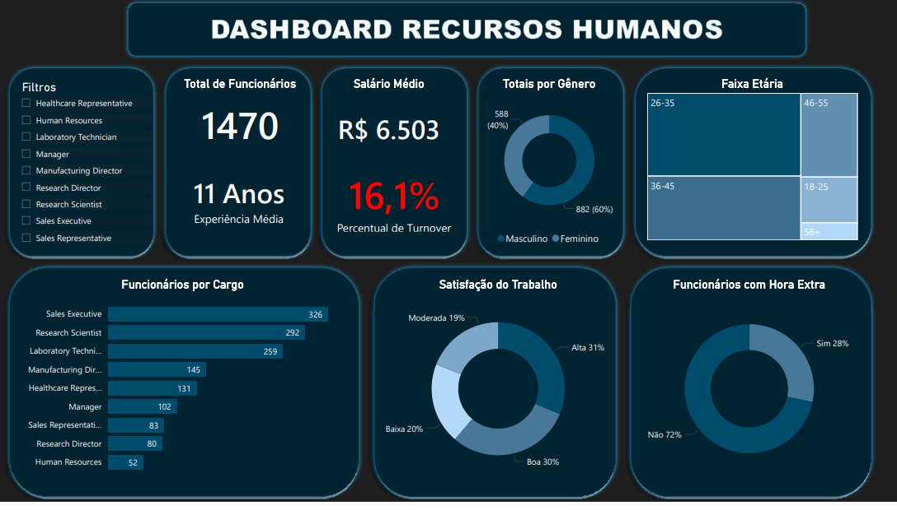

# 📊 Dashboard de Recursos Humanos - Workforce Overview

*(Painel executivo de People Analytics desenvolvido no Power BI para monitoramento estratégico da força de trabalho.)*

## 💡 Visão Geral
Este projeto transforma dados brutos de RH em um painel interativo e gerencial, permitindo que líderes e times de People Analytics acompanhem indicadores críticos de forma rápida e visual.

## 🎯 Perguntas de Negócio Respondidas
O painel foi projetado para responder às seguintes questões:
- **Headcount:** Quantos colaboradores ativos temos e como estão distribuídos?
- **Perfil Demográfico:** Qual a distribuição por Gênero e Faixa Etária?
- **Financeiro:** Qual o impacto da folha salarial média por departamento?
- **Clima & Retenção:** Qual o nível de satisfação médio e a taxa de Turnover (rotatividade)?
- **Operacional:** Qual o volume de funcionários realizando horas extras?

## 🛠️ Tecnologias Utilizadas
- **Microsoft Power BI:** Para estruturação visual e interatividade.
- **Power Query (ETL):** Limpeza, tratamento de dados e padronização de colunas.
- **DAX:** Criação de medidas para cálculos de:
  - Headcount Total.
  - Taxa de Turnover (Rotatividade).
  - Médias Salariais e de Idade.
  - Formatação Condicional e Segmentação.
- **Photoshop/PowerPoint:** Prototipagem do background e layout (Grid System).

## 📂 Estrutura do Dataset
O projeto utiliza uma base de dados fictícia contendo:
- Dados Demográficos (Idade, Gênero, Estado Civil).
- Dados Contratuais (Departamento, Cargo, Salário, Anos de Empresa).
- Dados de Pesquisa (Satisfação, Envolvimento, Desempenho).

## 🚀 Como Visualizar
1. Baixe o arquivo `dashboard_rh_overview.pbix` neste repositório.
2. Abra com o **Power BI Desktop**.
3. Nenhuma configuração de fonte de dados é necessária, a base já está embutida no arquivo.
4. Navegue pelos filtros laterais para segmentar por Departamento e/ou Cargo.

## 💾 Fonte dos Dados
O dataset utilizado neste projeto é público e foi disponibilizado pela IBM Data Scientists.
- **Nome:** IBM HR Analytics Employee Attrition & Performance
- **Link:** [Acesse no Kaggle](https://www.kaggle.com/datasets/pavansubhasht/ibm-hr-analytics-attrition-dataset/)

---
## 👤 Autor
**André Tavares**

